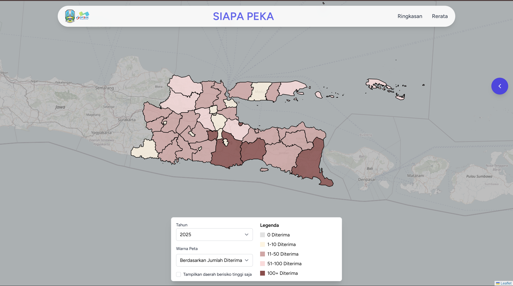

#  SIAPA PEKA
### **Sistem Informasi Digital Pencegahan Perkawinan Anak**

<div align="center">


**Pencegahan Perkawinan Anak • Pemantauan Data • Komunikasi Informasi Edukasi**

[](LICENSE)
[](https://laravel.com)
[](https://react.com)
[](https://php.net)
[](https://php.net)
[](https://github.com/pemprovinsi-jatim/siapa-peka)

</div>

---

##  Tentang Siapa Peka

<p align="justify">
<b>SIAPA PEKA</b> adalah sistem informasi digital terpadu yang dikembangkan khusus untuk <b>pencegahan perkawinan anak</b> di Provinsi Jawa Timur. Aplikasi ini berfungsi sebagai platform monitoring, analisis data, dan media Komunikasi Informasi Edukasi (KIE) yang komprehensif untuk mendukung program pencegahan perkawinan anak secara berkelanjutan.
</p>

---

##  Fitur Utama

<div align="center">
    <table style="width:100%; border:1px solid #555; border-collapse:collapse;">
<tr>
  <td style="width:50%; vertical-align:top; padding:15px; border-right:1px solid #555;">

  <h3>🗺️ Peta Interaktif Jawa Timur</h3>
  <ul>
    <li>Visualisasi data kabupaten/kota</li>
    <li>Pewarnaan tingkat kasus</li>
    <li>Perbesar dan geser interaktif</li>
  </ul>

  <h3>📊 Analisis Beranda</h3>
  <ul>
    <li>Pencegahan perkawinan anak</li>
    <li>Tren dispensasi kawin</li>
    <li>Progress berkelanjutan</li>
  </ul>

  </td>
  <td style="width:50%; vertical-align:top; padding:15px;">

  <h3>📈 Sistem Pelaporan Terpadu</h3>
  <ul>
    <li>Laporan Ringkasan</li>
    <li>Klasifikasi pendidikan</li>
    <li>Ekspor data berbagai format</li>
  </ul>

  <h3>👥 Survei & Forum Anak</h3>
  <ul>
    <li>Forum diskusi</li>
    <li>Umpan balik dari masyarakat</li>
    <li>Analisis hasil survei </li>
  </ul>

  </td>
</tr>
</table>
</div>


##  Langkah Instalasi

Ikuti langkah berikut untuk menjalankan projek:

---


```bash
# 1. Install Dependencies
composer install
npm install
# 2. Setup Environment
cp .env.example .env
# 3. Migrasi Database + Seeder & Import Data
php artisan migrate --seed
php artisan import:city-features
php artisan import:api-prov-jatim
php artisan db:seed --class=ForumChildrenSeeder
# 4. Optimisasi 
php artisan optimize:clear
php artisan storege:link
# 5. Jalankan Server
php artisan serve
npm run dev
```
---

##  Dokumentasi

<div align="center">

###  Beranda Peta 



</div>

---

##  Pencipta

-  **Haafiz Ghifari Rarian** - *UI/UX Designer*
-  **Farah Bianca** - *Front-end Developer*
-  **Natasya Hayudyo Murthiningtyas** - *Front-end Developer*
-  **Moch. Azriel Maulana R.** - *Fullstack Developer*
-  **Nurwahyu Akbar Maulidy** - *Fullstack Developer*


---

<div align="center">

###  **"SIAPA PEKA - Sistem Informasi Digital Pencegahan Perkawinan Anak"**

**Dikembangkan dengan hati untuk Pencegahan Perkawinan Anak**

[](https://jatimprov.go.id)
[](https://siapa-peka.jatimprov.go.id)
[](https://www.unicef.org/indonesia/)

---

*© 2025 SIAPA PEKA - Pemerintah Provinsi Jawa Timur. Untuk masa depan anak yang lebih baik.*

**"Setiap anak berhak mendapatkan masa kecil yang bahagia dan pendidikan yang layak"**

</div>
